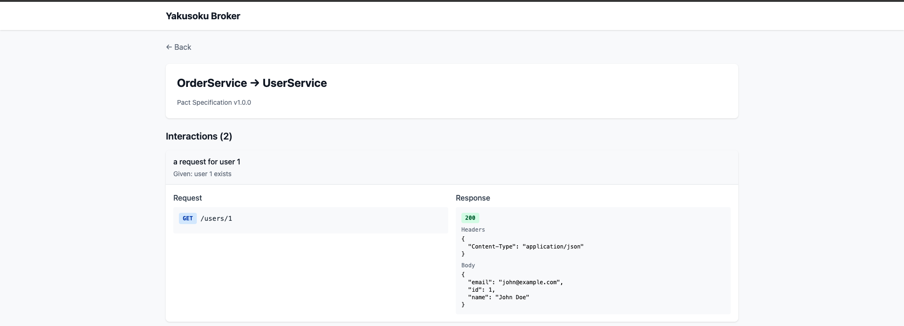

# Yakusoku

[](https://github.com/jt-chihara/yakusoku/actions/workflows/test.yml)
[](https://github.com/jt-chihara/yakusoku/actions/workflows/e2e.yml)
[](https://opensource.org/licenses/MIT)

Consumer-driven な契約テスト CLI ツール。Pact Specification v3/v4 互換。

## 契約テスト (Consumer Driven Contract Test) とは

マイクロサービス間の API 連携をテストする手法です。従来の E2E テストとは異なり、各サービスを独立してテストできます。

### 課題: マイクロサービス間の連携テスト

```
OrderService → UserService → PaymentService
     ↓
  全サービスを起動して E2E テスト？
  → 環境構築が大変、テストが遅い、障害点の特定が困難
```

### 解決策: 契約テスト

Consumer（API を呼ぶ側）が「期待する API の振る舞い」を契約として定義し、Provider（API を提供する側）がその契約を満たしているか検証します。

```
┌─────────────────────────────────────────────────────────────────┐
│ Consumer (OrderService) チーム                                  │
│                                                                 │
│  1. テストを書く（UserService の API をどう使うか定義）          │
│  2. go test 実行 → 契約ファイル生成                             │
│  3. Broker に publish                                           │
└─────────────────────────────────────────────────────────────────┘
                              │
                              ▼
                    ┌──────────────────┐
                    │  Yakusoku Broker │
                    │   (契約を保管)    │
                    └──────────────────┘
                              │
                              ▼
┌─────────────────────────────────────────────────────────────────┐
│ Provider (UserService) チーム                                   │
│                                                                 │
│  yakusoku verify で自分の API が契約を満たすか検証               │
└─────────────────────────────────────────────────────────────────┘
```

Consumer が「こう呼んだらこう返ってくるはず」という期待を契約として定義し、Provider がそれを守っているか検証する、という Consumer-Driven な設計です。

### メリット

- **高速**: 各サービス単独でテスト実行、他サービスの起動不要
- **独立性**: チームごとに独立してテスト・デプロイ可能
- **早期発見**: API 変更による破壊的影響を CI で検知
- **ドキュメント**: 契約ファイルが API 仕様のドキュメントになる

### テストピラミッドにおける位置づけ

```
                    /\
                   /  \
                  / E2E \        ← 遅い・不安定・高コスト
                 /--------\         実際に全サービスを起動
                /          \
               / Contract   \    ← 契約テスト（ここ！）
              /--------------\      サービス間の「約束」を検証
             /                \
            /   Integration    \  ← Request Spec など
           /--------------------\    単一サービス内の結合テスト
          /                      \
         /         Unit           \ ← Model Spec など
        /--------------------------\   最も高速・安定・低コスト
```

| テスト種別 | 対象 | 特徴 |
|-----------|------|------|
| **Unit Test**<br>(Model Spec) | 単一クラス・関数 | 外部依存なし、最速、ロジックの正確性を検証 |
| **Integration Test**<br>(Request Spec) | 単一サービス内の API | DB・ミドルウェア込み、自サービスの振る舞いを検証 |
| **Contract Test** | サービス間の境界 | 他サービスは起動不要、API の「契約」が守られているか検証 |
| **E2E Test** | システム全体 | 全サービス起動、実際のユーザーフローを検証 |

### 各テストの責務

```
┌─────────────────────────────────────────────────────────────────┐
│ OrderService                                                    │
│                                                                 │
│  ┌──────────────┐    ┌──────────────┐    ┌──────────────┐      │
│  │  Unit Test   │    │  Request Spec │    │ Contract Test│      │
│  │              │    │               │    │  (Consumer)  │      │
│  │ Order モデル  │    │ POST /orders │    │              │      │
│  │ のロジック    │    │ が正しく動作  │    │ UserService  │      │
│  │ が正しいか    │    │ するか        │    │ をこう呼ぶ   │      │
│  └──────────────┘    └──────────────┘    └──────────────┘      │
│         ↓                   ↓                   ↓               │
│   ビジネスロジック     自サービスの API    他サービスとの境界     │
└─────────────────────────────────────────────────────────────────┘
                                                  │
                                                  ▼ 契約ファイル
┌─────────────────────────────────────────────────────────────────┐
│ UserService                                                     │
│                                                                 │
│  ┌──────────────┐    ┌──────────────┐    ┌──────────────┐      │
│  │  Unit Test   │    │  Request Spec │    │ Contract Test│      │
│  │              │    │               │    │  (Provider)  │      │
│  │ User モデル  │    │ GET /users/1 │    │              │      │
│  │ のロジック   │    │ が正しく動作  │    │ 契約通りの   │      │
│  │ が正しいか   │    │ するか        │    │ レスポンスか │      │
│  └──────────────┘    └──────────────┘    └──────────────┘      │
└─────────────────────────────────────────────────────────────────┘
```

**契約テストは E2E テストの代替ではなく、テストピラミッドの中間層として「サービス間連携の信頼性」を効率的に担保します。**

## 特徴

- **Consumer SDK** - Consumer テストで契約の期待値を定義
- **Provider 検証** - 契約ファイルに対して Provider API を検証
- **Pact v3 互換** - Pact Specification v3 と完全互換
- **CLI ツール** - コマンドラインから契約を管理・検証

## インストール

### ソースからビルド

```bash
git clone https://github.com/jt-chihara/yakusoku.git
cd yakusoku
make build
```

バイナリは `bin/` ディレクトリに生成されます。

## クイックスタート

### 1. Consumer 契約を定義 (Go SDK)

```go
package main

import (
    "net/http"
    "testing"

    "github.com/jt-chihara/yakusoku/sdk/go/yakusoku"
)

func TestUserServiceClient(t *testing.T) {
    pact := yakusoku.NewPact(yakusoku.Config{
        Consumer: "OrderService",
        Provider: "UserService",
        PactDir:  "./pacts",
    })
    defer pact.Teardown()

    // インタラクションを定義
    pact.
        Given("user 1 exists").
        UponReceiving("a request for user 1").
        WithRequest(yakusoku.Request{
            Method: "GET",
            Path:   "/users/1",
        }).
        WillRespondWith(yakusoku.Response{
            Status: 200,
            Headers: map[string]string{
                "Content-Type": "application/json",
            },
            Body: map[string]interface{}{
                "id":   1,
                "name": "John Doe",
            },
        })

    // 実際のクライアントコードで検証
    err := pact.Verify(func() error {
        resp, err := http.Get(pact.ServerURL() + "/users/1")
        if err != nil {
            return err
        }
        defer resp.Body.Close()
        // クライアントコードをここに記述
        return nil
    })

    if err != nil {
        t.Fatal(err)
    }
}
```

このテストを実行すると、`./pacts/orderservice-userservice.json` に契約ファイルが生成されます。

### 2. Provider を検証

```bash
yakusoku verify \
  --provider-base-url http://localhost:8080 \
  --pact-file ./pacts/orderservice-userservice.json
```

Provider States を使用する場合:

```bash
yakusoku verify \
  --provider-base-url http://localhost:8080 \
  --pact-file ./pacts/orderservice-userservice.json \
  --provider-states-setup-url http://localhost:8080/provider-states
```

## CLI コマンド

### verify

契約ファイルに対して Provider API を検証します。

```bash
yakusoku verify [flags]

フラグ:
  --provider-base-url string           Provider API のベース URL (必須)
  --pact-file string                   契約ファイルのパス (必須)
  --provider-states-setup-url string   Provider States セットアップ URL
  --verbose                            詳細出力を表示
```

### version

バージョン情報を表示します。

```bash
yakusoku version
```

## 契約ファイルフォーマット

Yakusoku は Pact Specification v3 フォーマットを使用します:

```json
{
  "consumer": { "name": "OrderService" },
  "provider": { "name": "UserService" },
  "interactions": [
    {
      "description": "a request for user 1",
      "providerState": "user 1 exists",
      "request": {
        "method": "GET",
        "path": "/users/1"
      },
      "response": {
        "status": 200,
        "headers": {
          "Content-Type": "application/json"
        },
        "body": {
          "id": 1,
          "name": "John Doe"
        }
      }
    }
  ],
  "metadata": {
    "pactSpecification": { "version": "3.0.0" }
  }
}
```

## Provider States

Provider States を使用すると、検証前にテストデータをセットアップできます。以下の形式の POST リクエストを受け付けるエンドポイントを実装してください:

```json
{
  "state": "user 1 exists",
  "params": { "userId": 1 }
}
```

実装例:

```go
http.HandleFunc("/provider-states", func(w http.ResponseWriter, r *http.Request) {
    var state struct {
        State  string                 `json:"state"`
        Params map[string]interface{} `json:"params"`
    }
    json.NewDecoder(r.Body).Decode(&state)

    switch state.State {
    case "user 1 exists":
        // テストデータベースに user 1 をセットアップ
    }

    w.WriteHeader(http.StatusOK)
})
```

## Yakusoku Broker

契約ファイルを中央管理するためのサーバーです。複数チーム間での契約共有や can-i-deploy チェックに使用します。

### 起動方法

#### インメモリ（開発用）

```bash
yakusoku-broker --port 8080
```

#### AWS S3（本番用）

```bash
yakusoku-broker --storage s3 \
  --s3-bucket my-yakusoku-bucket \
  --s3-prefix pacts/ \
  --s3-region ap-northeast-1
```

### Docker Compose で起動

LocalStack (S3) と Broker をまとめて起動できます。

```bash
docker compose up -d
```

起動後:
- **Broker**: http://localhost:8080
- **Web UI**: http://localhost:8080/ui
- **LocalStack**: http://localhost:4566

#### 契約を publish

```bash
curl -X POST http://localhost:8080/pacts/provider/UserService/consumer/OrderService/version/1.0.0 \
  -H "Content-Type: application/json" \
  -d @./pacts/orderservice-userservice.json
```

#### 契約を取得

```bash
# 特定バージョン
curl http://localhost:8080/pacts/provider/UserService/consumer/OrderService/version/1.0.0

# 最新バージョン
curl http://localhost:8080/pacts/provider/UserService/consumer/OrderService/latest
```

#### can-i-deploy チェック

```bash
curl "http://localhost:8080/matrix?pacticipant=OrderService&version=1.0.0"
```

### LocalStack を単独で使う場合

Broker をローカルでビルドして実行する場合:

```bash
# LocalStack を起動
docker compose up localstack -d

# Broker を起動
yakusoku-broker --storage s3 \
  --s3-bucket yakusoku \
  --s3-endpoint http://localhost:4566 \
  --s3-region us-east-1
```

### S3 のデータ構造

```
s3://yakusoku-local/pacts/
├── index.json                    # バージョン一覧と検証結果
└── contracts/
    └── OrderService/
        └── UserService/
            ├── 1.0.0.json
            └── 2.0.0.json
```

### Broker API エンドポイント

| メソッド | パス | 説明 |
|---------|------|------|
| GET | `/pacts` | 全契約一覧 |
| GET | `/pacts/provider/{provider}` | Provider の契約一覧 |
| GET | `/pacts/provider/{provider}/consumer/{consumer}/version/{version}` | 特定の契約を取得 |
| GET | `/pacts/provider/{provider}/consumer/{consumer}/latest` | 最新の契約を取得 |
| POST | `/pacts/provider/{provider}/consumer/{consumer}/version/{version}` | 契約を publish |
| DELETE | `/pacts/provider/{provider}/consumer/{consumer}/version/{version}` | 契約を削除 |
| POST | `/pacts/.../verification-results` | 検証結果を記録 |
| GET | `/matrix?pacticipant=X&version=Y` | can-i-deploy チェック |
| GET | `/ui` | Web UI |

### Web UI

Broker には契約を閲覧するための Web UI が内蔵されています。Broker 起動後、ブラウザで `http://localhost:8080/ui` にアクセスしてください。

Web UI では以下の機能が利用できます：
- 登録されている契約の一覧表示
- 契約の詳細表示（インタラクション、リクエスト/レスポンスの内容）



## 開発

### 必要条件

- Go 1.24+
- Node.js 22+ (Web UI ビルド用)
- pnpm (Web UI ビルド用)

### ビルド

```bash
make build
```

### テスト

```bash
make test
```

### Lint

```bash
make lint
```

### 全チェック

```bash
make all  # lint, test, build
```

## プロジェクト構成

```
.
├── cmd/
│   ├── yakusoku/          # CLI エントリーポイント
│   └── yakusoku-broker/   # Broker サーバー
├── internal/
│   ├── broker/            # Broker 実装
│   │   └── ui/            # Web UI 埋め込み
│   ├── cli/               # CLI コマンド
│   ├── contract/          # 契約の型、パーサー、バリデーター、ライター
│   ├── matcher/           # マッチングルール
│   ├── mock/              # モック HTTP サーバー
│   └── verifier/          # Provider 検証
├── sdk/
│   └── go/yakusoku/       # Go SDK
├── web/                   # Web UI ソース (Vite + React + TypeScript)
└── tests/
    ├── unit/              # ユニットテスト
    └── integration/       # 統合テスト
```

## プライバシー

Yakusoku は**いかなる使用状況データも収集・送信しません**。

- 外部サーバーへの通信なし
- 使用状況の追跡なし
- 匿名データの収集もなし

## ライセンス

MIT
